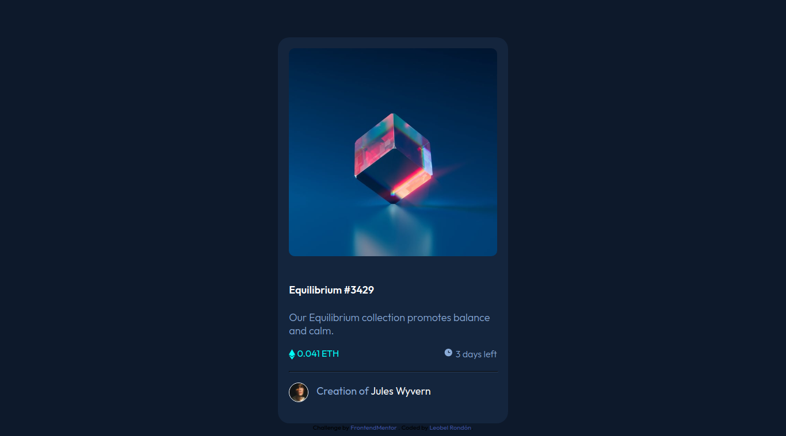

# NFT Preview Card 
This is a solution to the [NFT preview card component challenge on Frontend Mentor](https://www.frontendmentor.io/challenges/nft-preview-card-component-SbdUL_w0U). Frontend Mentor challenges help you improve your coding skills by building realistic projects.

## Table of contents

- [Overview](#overview)
    - [The challenge](#the-challenge)
    - [Screenshot](#screenshot)
    - [Links](#links)
- [My process](#my-process)
    - [Built with](#built-with)
    - [What I learned](#what-i-learned)
    - [Useful resources](#useful-resources)
- [Author](#author)

## Overview

### The challenge

Users should be able to:

- View the optimal layout depending on their device's screen size
- See hover states for interactive elements

### Screenshot

### Links

- Solution URL: [Codepen Site](https://codepen.io/kabirdeula/pen/mdBaZRQ)
- Live Site URL: [Netlify Site](https://kind-varahamihira-852c27.netlify.app)

## My process

### Built with

- Semantic HTML5 markup
- CSS custom properties

### What I learned

I learn about the property called hsl while is hue, saturation and lightness.

## Author

- Website - [Kabir Deula](https://www.kabirdeula.com.np)
- Frontend Mentor - [@kabirdeula](https://www.frontendmentor.io/profile/kabirdeula)
